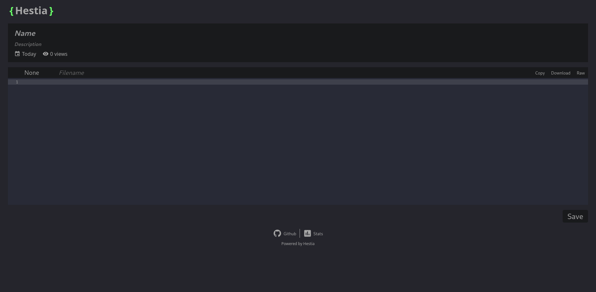

# Hestia

Hestia stands out as a user-friendly and readily deployable pastebin application. Its versatility lies in its ability to store data in raw binary format, making it adaptable to various use cases.



## Key Features
- Easy Deployment: Hestia can be quickly deployed on various platforms with minimal configuration, making it ideal for both personal and enterprise use.
- Versatile Storage: Unlike most pastebin applications that store data in plain text format, Hestia utilizes raw binary storage, enhancing security and enabling support for a wide range of file types.
- Customizable Settings: Users can tailor Hestia to their specific needs through customizable settings, including theme and storage options.
- Performance: Hestia is optimized for efficient performance, ensuring rapid response times even under heavy loads. Its streamlined architecture minimizes resource usage and maximizes throughput, providing a smooth user experience.
- Scalability: Hestia is designed to scale effortlessly, allowing it to accommodate growing usage demands without sacrificing performance or reliability.
- Intuitive Interface: The intuitive user interface of Hestia ensures a seamless experience for both creators and consumers of pastes, facilitating easy sharing and retrieval of information.
- API Support: Hestia offers comprehensive API support, enabling seamless integration with existing workflows and applications.

## Demo
Out of the box, you can clone this repository and run the code. This will provide a working demo.

### Requirements
- [Rust](https://www.rust-lang.org/tools/install)
- [NodeJS](https://nodejs.org/en/download)
- OpenSSL dev lib (for example libssl-dev on Debian or openssl on Arch) 
- Ports **3000** and **5173** should be unused.\
You can check this with a commmand like `sudo lsof -i:3000 -i:5173`

### Running demo
Out of the box Hestia is configured to use a naive memory implementation. In order to start a minimal working instance of Hestia, you just have to start everything with it's default config.

*Assuming you've set the working directory to the cloned repository*:

In one window
```bash
$ cd server
$ cargo run --release # Run the server
```

In another window
```bash
$ cd client
$ npm i               # install dependencies
$ npm run dev         # Run the client
```

You should now be able to see the Pastebin running at http://localhost:5173. \
This will save bins in memory, but otherwise function as normal.

## Installation
To install Hestia, follow the instructions provided in the [Installation Guide](docs/INSTALLATION.md).

## Configuration
To configure Hestia, follow the instructions provided in the [Configuration Guide](docs/CONFIGURATION.md).
